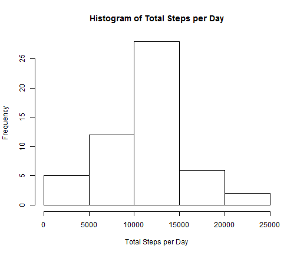
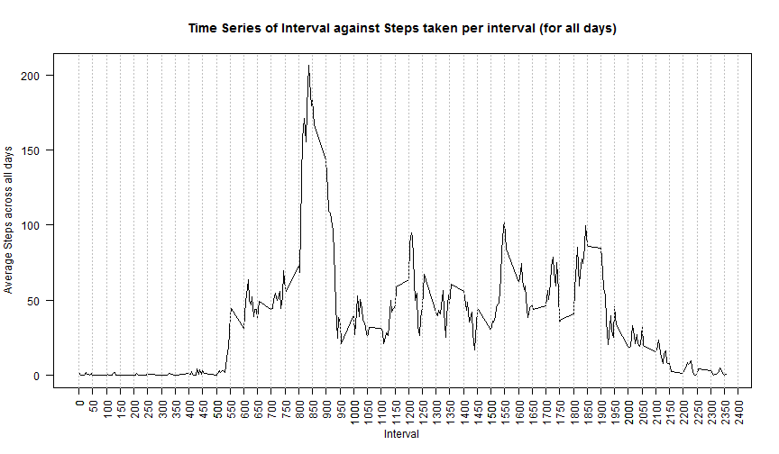
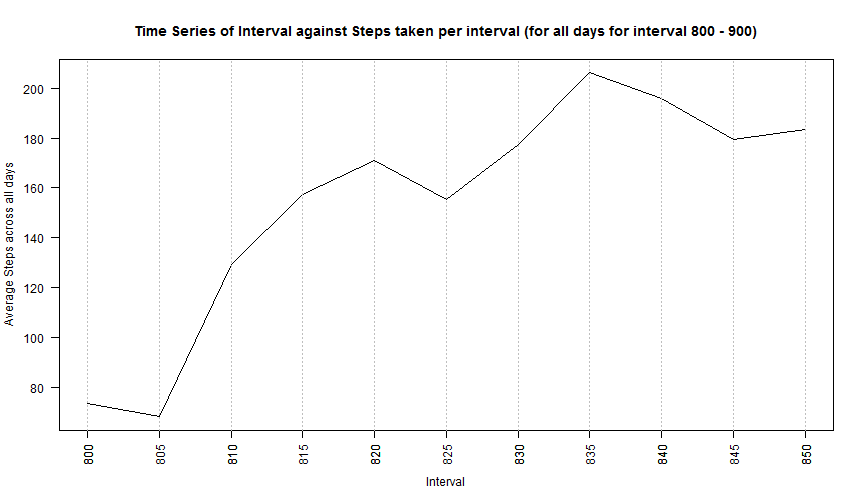
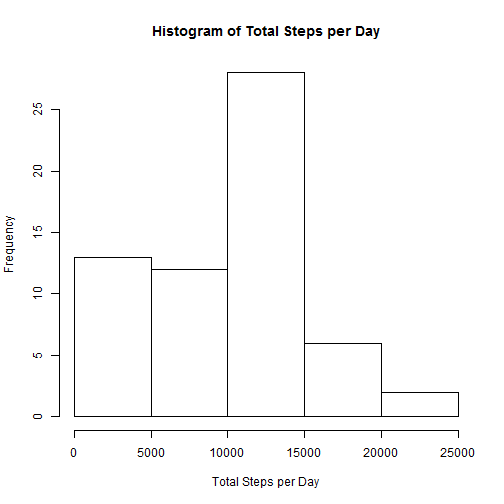
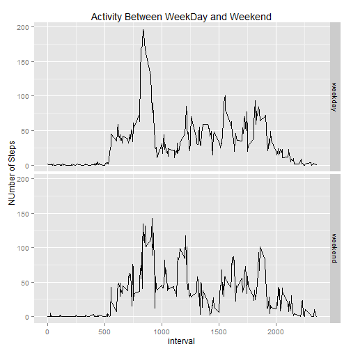

## Purpose:

The purpose of the study is to analyze data from a personal activity monitoring device. This device collects data at 5 minute intervals through out the day. The data consists of two months of data from an anonymous individual collected during the months of October and November, 2012 and include the number of steps taken in 5 minute intervals each day.

## Processing Steps:

### 1. Set Global Options:


```r
library(knitr)
opts_chunk$set(echo=TRUE, warning=FALSE)
```

### 2. Reading File


```r
# Display current directory
getwd()
```

```
## [1] "E:/Coursera_R_Reproducible_Research/RepData_PeerAssessment1"
```

```r
# Checking Existence of file
if (!file_test("-f", "./repdata_activity.zip") &
!file_test("-d", "./repdata_activity")) {
# Required for Windows Machines
setInternet2(TRUE)
# Download File
download.file("https://d396qusza40orc.cloudfront.net/repdata%2Fdata%2Factivity.zip", "./repdata_activity.zip", mode = "wb")
# Unzipping the file
utils::unzip("./repdata_activity.zip", exdir = ".")
}
rep_data <- read.csv("./activity.csv")
```

### 3. Performing Exploratory Analysis of Original Data


```r
str(rep_data)
```

```
## 'data.frame':	17568 obs. of  3 variables:
##  $ steps   : int  NA NA NA NA NA NA NA NA NA NA ...
##  $ date    : Factor w/ 61 levels "2012-10-01","2012-10-02",..: 1 1 1 1 1 1 1 1 1 1 ...
##  $ interval: int  0 5 10 15 20 25 30 35 40 45 ...
```

```r
summary(rep_data)
```

```
##      steps                date          interval     
##  Min.   :  0.00   2012-10-01:  288   Min.   :   0.0  
##  1st Qu.:  0.00   2012-10-02:  288   1st Qu.: 588.8  
##  Median :  0.00   2012-10-03:  288   Median :1177.5  
##  Mean   : 37.38   2012-10-04:  288   Mean   :1177.5  
##  3rd Qu.: 12.00   2012-10-05:  288   3rd Qu.:1766.2  
##  Max.   :806.00   2012-10-06:  288   Max.   :2355.0  
##  NA's   :2304     (Other)   :15840
```

```r
head(rep_data)
```

```
##   steps       date interval
## 1    NA 2012-10-01        0
## 2    NA 2012-10-01        5
## 3    NA 2012-10-01       10
## 4    NA 2012-10-01       15
## 5    NA 2012-10-01       20
## 6    NA 2012-10-01       25
```

### 4. Analysis of total number of steps taken per day

Perform an analysis of daily total steps taken per day.

#### 4a) Calculate the total number of steps taken per day


```r
# Remove all NA cases
steps_pd <- na.omit(rep_data)
# Confirm if there is any NA
anyNA(steps_pd)
```

```
## [1] FALSE
```

```r
# Calculate Total Steps per day - Store in a data frame
tot_steps_pd <- aggregate(steps_pd$steps, by=list(steps_pd$date), FUN="sum")
# Checking Data Frame Characteristics
str(tot_steps_pd)
```

```
## 'data.frame':	53 obs. of  2 variables:
##  $ Group.1: Factor w/ 61 levels "2012-10-01","2012-10-02",..: 2 3 4 5 6 7 9 10 11 12 ...
##  $ x      : int  126 11352 12116 13294 15420 11015 12811 9900 10304 17382 ...
```

```r
# Changing Column Names
colnames(tot_steps_pd) <- c("date", "totalsteps")
# Confirm Column Name Changes
colnames(tot_steps_pd)
```

```
## [1] "date"       "totalsteps"
```

```r
# Checking sample data values
head(tot_steps_pd)
```

```
##         date totalsteps
## 1 2012-10-02        126
## 2 2012-10-03      11352
## 3 2012-10-04      12116
## 4 2012-10-05      13294
## 5 2012-10-06      15420
## 6 2012-10-07      11015
```
#### 4b) Histogram of total number of steps

Histogram of total number of steps.


```r
# Histogram of Total Steps Taken
hist(tot_steps_pd$totalsteps, main = "Histogram of Total Steps per Day", xlab = "Total Steps per Day")
```

 

#### 4c) mean and median of the total number of steps taken per day


```r
mean(tot_steps_pd$totalsteps)
```

```
## [1] 10766.19
```

```r
median(tot_steps_pd$totalsteps)
```

```
## [1] 10765
```

### 5. Analysis of average daily activity pattern

#### 5a) Preprocessing data for analysis


```r
# Calculating Average Steps for each interval & assigning to a data frame
steps_pinv <- aggregate(steps_pd$steps, by=list(steps_pd$interval), FUN="mean")
# Changing Default column names
colnames(steps_pinv) <- c("interval", "avg_steps")
# Checking Sample Data
head(steps_pinv)
```

```
##   interval avg_steps
## 1        0 1.7169811
## 2        5 0.3396226
## 3       10 0.1320755
## 4       15 0.1509434
## 5       20 0.0754717
## 6       25 2.0943396
```
#### 5b) Plotting Time Series to idetify the interval with max average value

Time series plot to idetify the 5 minute interval containing the maximum number of steps.


```r
xtp <- seq(0, 2400, 50)
xtl <- as.character(seq(0, 2400, 50))
# Plotting
plot(steps_pinv$interval, steps_pinv$avg_steps, type = "l", main = "Time Series of Interval against Steps taken per interval (for all days)", xlab = "Interval", ylab = "Average Steps across all days", las = 2, xant = "n")
axis(side = 1, 
     at = xtp, 
     labels = xtl,
     las = 2)
abline(v = xtp,col="gray",lty=3)
```

 

From the above plot it seems that the average value is contained within interval 800 and 850 minutes. Therefore, in order to capture the precise 5 minute interval further data analysis is performed for the intevals between 8(800 and 950 minutes).


```r
# Subsetting dataset between interval 800 and 850
steps_pinv_800_850 <- steps_pinv[steps_pinv$interval >= 800 & steps_pinv$interval <= 850, ]
# Checking Sample data between 800 and 850
head(steps_pinv_800_850)
```

```
##     interval avg_steps
## 97       800  73.37736
## 98       805  68.20755
## 99       810 129.43396
## 100      815 157.52830
## 101      820 171.15094
## 102      825 155.39623
```

```r
# Creating custom X-axis labels for easy visualizaton
xtp1 <- seq(800, 850, 5)
xtl1 <- as.character(seq(800, 850, 5))
# Plotting the same
plot(steps_pinv_800_850$interval, steps_pinv_800_850$avg_steps, type = "l", main = "Time Series of Interval against Steps taken per interval (for all days for interval 800 - 900)", xlab = "Interval", ylab = "Average Steps across all days", las = 2, xant = "n")
axis(side = 1, 
     at = xtp1, 
     labels = xtl1,
     las = 2)
# Applying grid lines
abline(v = xtp1,col="gray",lty=3)
```

 

#### 5c) Conclusions

From the above plot, we could conclude that the peak occured interval 835 to 840 minutes.

### 6. NA value analysis

This sections deals with analysing NA values, replacing the same with 0 and re-calculatng the metrices from section 4, of this document.

#### 6a) Total NAs


```r
# Calculating # of NAs as difference between Total # of rows in original dataset and # of rows in dataset without NAs
no_of_NAs <- nrow(rep_data) - nrow(steps_pd)
no_of_NAs
```

```
## [1] 2304
```
#### 6b) Replacing NAs with 0


```r
# Copying original dataset into a new DF
steps_pd_NA_as_0 <- rep_data
# Replacing NAs with 0
steps_pd_NA_as_0[is.na(steps_pd_NA_as_0)] <- 0
# Checking if any NA exists after replacement
anyNA(steps_pd_NA_as_0)
```

```
## [1] FALSE
```
#### 6c) Histogram of Total Steps per Day after NA relacement in step 6b)


```r
# Calculate Total Steps per day - Store in a data frame
tot_steps_pd_NA_as_0 <- aggregate(steps_pd_NA_as_0$steps, by=list(steps_pd_NA_as_0$date), FUN="sum")
# Checking Data Frame Characteristics
str(tot_steps_pd_NA_as_0)
```

```
## 'data.frame':	61 obs. of  2 variables:
##  $ Group.1: Factor w/ 61 levels "2012-10-01","2012-10-02",..: 1 2 3 4 5 6 7 8 9 10 ...
##  $ x      : num  0 126 11352 12116 13294 ...
```

```r
# Changing Column Names
colnames(tot_steps_pd_NA_as_0) <- c("date", "totalsteps")
# Confirm Column Name Changes
colnames(tot_steps_pd_NA_as_0)
```

```
## [1] "date"       "totalsteps"
```

```r
# Checking sample data values
head(tot_steps_pd_NA_as_0)
```

```
##         date totalsteps
## 1 2012-10-01          0
## 2 2012-10-02        126
## 3 2012-10-03      11352
## 4 2012-10-04      12116
## 5 2012-10-05      13294
## 6 2012-10-06      15420
```

```r
# Histogram of Total Steps Taken
hist(tot_steps_pd_NA_as_0$totalsteps, main = "Histogram of Total Steps per Day", xlab = "Total Steps per Day")
```

 

#### 6d) mean and median of the total number of steps taken per day after NA replacement


```r
mean(tot_steps_pd_NA_as_0$totalsteps)
```

```
## [1] 9354.23
```

```r
median(tot_steps_pd_NA_as_0$totalsteps)
```

```
## [1] 10395
```

#### 6e) Conculsions

Both mean and median deviate substantially from the analysis results of section 4c).
As expected the values are reduced from earlier once since total number of records increased although their contribution to the total is 0.

### 7. Activity patterns between weekdays and weekends

This section analyses the activity patterns between weekdays and weekends.

#### 7a) Creating plot to analyse the activity patterns


```r
# Add a column for day of the week (0 - 6, starting Sunday)
steps_pd_NA_as_0$day <- as.POSIXlt(as.Date(steps_pd_NA_as_0$date))$wday
# Checking the newly created column
str(steps_pd_NA_as_0)
```

```
## 'data.frame':	17568 obs. of  4 variables:
##  $ steps   : num  0 0 0 0 0 0 0 0 0 0 ...
##  $ date    : Factor w/ 61 levels "2012-10-01","2012-10-02",..: 1 1 1 1 1 1 1 1 1 1 ...
##  $ interval: int  0 5 10 15 20 25 30 35 40 45 ...
##  $ day     : int  1 1 1 1 1 1 1 1 1 1 ...
```

```r
# Replacing day of week with Weekends (0 & 1) as 1 and Weekdays (2 - 6) as 0
steps_pd_NA_as_0[steps_pd_NA_as_0$day <= 1, 4] <- 1
steps_pd_NA_as_0[steps_pd_NA_as_0$day > 1, 4] <- 0
# Checking the column
str(steps_pd_NA_as_0)
```

```
## 'data.frame':	17568 obs. of  4 variables:
##  $ steps   : num  0 0 0 0 0 0 0 0 0 0 ...
##  $ date    : Factor w/ 61 levels "2012-10-01","2012-10-02",..: 1 1 1 1 1 1 1 1 1 1 ...
##  $ interval: int  0 5 10 15 20 25 30 35 40 45 ...
##  $ day     : num  1 1 1 1 1 1 1 1 1 1 ...
```

```r
# Creating DF for Average accross all Weekend/Weekends per 5 minute interval
tot_steps_pd_weekd <- aggregate(steps_pd_NA_as_0$steps, by=list(steps_pd_NA_as_0$interval , as.numeric(steps_pd_NA_as_0$day)), FUN="mean")
# Checking Data Frame Characteristics
str(tot_steps_pd_weekd)
```

```
## 'data.frame':	576 obs. of  3 variables:
##  $ Group.1: int  0 5 10 15 20 25 30 35 40 45 ...
##  $ Group.2: num  0 0 0 0 0 0 0 0 0 0 ...
##  $ x      : num  1.8409 0.4091 0.1591 0.1818 0.0909 ...
```

```r
# Changing Column Names
colnames(tot_steps_pd_weekd) <- c("interval", "day", "steps")
# Confirm Column Name Changes
colnames(tot_steps_pd_weekd)
```

```
## [1] "interval" "day"      "steps"
```

```r
# Converting day to a Factor variable with levels 1 for Weekend and 0 for Weekday
tot_steps_pd_weekd[tot_steps_pd_weekd$day == 1, 2] <- "weekend"
tot_steps_pd_weekd[tot_steps_pd_weekd$day == 0, 2] <- "weekday"
tot_steps_pd_weekd$day <- as.factor(tot_steps_pd_weekd$day)
# Checking Data Frame Characteristics
str(tot_steps_pd_weekd)
```

```
## 'data.frame':	576 obs. of  3 variables:
##  $ interval: int  0 5 10 15 20 25 30 35 40 45 ...
##  $ day     : Factor w/ 2 levels "weekday","weekend": 1 1 1 1 1 1 1 1 1 1 ...
##  $ steps   : num  1.8409 0.4091 0.1591 0.1818 0.0909 ...
```

```r
# Checking sample data values
head(tot_steps_pd_weekd)
```

```
##   interval     day      steps
## 1        0 weekday 1.84090909
## 2        5 weekday 0.40909091
## 3       10 weekday 0.15909091
## 4       15 weekday 0.18181818
## 5       20 weekday 0.09090909
## 6       25 weekday 0.54545455
```

```r
tail(tot_steps_pd_weekd)
```

```
##     interval     day     steps
## 571     2330 weekend  1.000000
## 572     2335 weekend 10.352941
## 573     2340 weekend  5.529412
## 574     2345 weekend  1.529412
## 575     2350 weekend  0.000000
## 576     2355 weekend  0.000000
```

```r
# Plotting Data
library(ggplot2)
g <- ggplot(tot_steps_pd_weekd, aes(interval, steps))
g <- g + geom_line()
g <- g + facet_grid(day ~ .)
g <- g + labs(title = "Activity Between WeekDay and Weekend") + labs(y = "NUmber of Steps")
g
```

 

#### 7b) Conclusion

The activity seems to be more during Weekdays than during Weekends, which is along expected lines.

